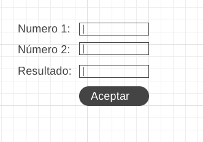

# Tarea 1. HTML básico

## EJERCICIO 1. Escribir un documento HTML que contenga la siguiente información:

* Nombre de tu universidad
* Nombre de tu carrera
* Tu nombre completo
* Semestre y grupo
* Requisitos de egreso de la carrera
* Datos detallados del primer semestre de la carrera como se documentan en el pland e estudios

## EJERCICIO 2. Utilizando HTML escribir una página personal que contenga:

Información personal como nombre, datos de contacto estudios y cursos previos, enlaces a páginas de interés o hobbies, imágenes y videos con los que te identifiques o te gusten.

## EJERCICIO 3. Utilizando HTML escribir un formulario como el que se muestra en la imagen.

## REQUISITOS
En todos los casos deberá utilizar los elementos de párrafo, encabezado, listas y tablas por lo menos.
